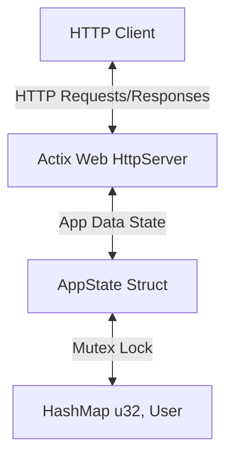

# Technical Documentation: RestfulApi Server

This document outlines the technical architecture, concurrency models, data structures, endpoint specifications, and compilation instructions for the RestfulApi application.

---

## System Architecture

The RestfulApi application is a lightweight, high-performance web service built with Rust using the **Actix Web** framework.



### Key Architectural Components

1.  **Asynchronous Runtime**: Actix Web runs on top of the Tokio-based Actix runtime, which provides high-concurrency event-driven network I/O.
2.  **Shared State (`AppState`)**: Because the web server spawns a pool of worker threads to handle incoming HTTP requests concurrently, the data storage must be shared safely across all threads.
3.  **Thread Safety (`Mutex`)**: Rust's standard library `std::sync::Mutex` guarantees mutual exclusion, preventing data races when multiple threads attempt to read or modify the user collection.

---

## Data Structures

### 1. The `User` Model
Represents the core domain entity of the system.

```rust
#[derive(Serialize, Deserialize, Clone)]
struct User {
    id: u32,
    name: String,
    status: String,
}
```

*   `id`: A unique 32-bit unsigned identifier.
*   `name`: A UTF-8 string containing the user's name.
*   `status`: A status indicator string (e.g. `"Active"`, `"Inactive"`).

### 2. The `AppState` Container
Wraps the thread-safe database representation.

```rust
struct AppState {
    users: Mutex<HashMap<u32, User>>,
}
```

*   `users`: A `HashMap` where the key is the user ID (`u32`) and the value is the `User` struct.
*   The `HashMap` is wrapped in a `Mutex` to allow safe, mutable access across HTTP worker threads.

---

## 🔌 API Endpoint Specifications

All API requests and responses utilize the `application/json` content type.

### 1. Root Probe / Health Check
Verifies that the server and API are operational.

*   **URL**: `/`
*   **Method**: `GET`
*   **Request Payload**: *None*
*   **Successful Response**:
    *   **Status**: `200 OK`
    *   **Body**:
        ```json
        {
          "message": "The Server and API are working!"
        }
        ```

### 2. Fetch User by ID
Retrieve details of a single user by their unique ID.

*   **URL**: `/users/{id}`
*   **Method**: `GET`
*   **URL Path Parameters**:
    *   `id` (integer, required): Unique identifier of the user.
*   **Successful Response**:
    *   **Status**: `200 OK`
    *   **Body**: A `User` JSON object.
*   **Error Response**:
    *   **Status**: `404 Not Found` (If no user matches the ID).

### 3. Create User
Add a new user to the database.

*   **URL**: `/users`
*   **Method**: `POST`
*   **Headers**:
    *   `Content-Type: application/json`
*   **Request Payload**: A `User` JSON object.
*   **Successful Response**:
    *   **Status**: `201 Created`
    *   **Body**: The created `User` JSON object.
*   **Error Response**:
    *   **Status**: `409 Conflict` (If a user with the requested ID already exists).

### 4. Update / Upsert User
Update details of an existing user or insert the user if they do not exist.

*   **URL**: `/update`
*   **Method**: `PUT`
*   **Headers**:
    *   `Content-Type: application/json`
*   **Request Payload**: A `User` JSON object.
*   **Successful Responses**:
    *   **Status**: `200 OK` (If an existing user entry was successfully updated).
    *   **Status**: `201 Created` (If a new user entry was successfully created).

### 5. Delete User
Remove a user entry from the database.

*   **URL**: `/del/{id}`
*   **Method**: `DELETE`
*   **URL Path Parameters**:
    *   `id` (integer, required): Unique identifier of the user to delete.
*   **Successful Response**:
    *   **Status**: `204 No Content` (If the user was successfully removed).
*   **Error Response**:
    *   **Status**: `404 Not Found` (If the requested user was not found).

---

## Building & Packaging on Windows

To compile this project locally into a standalone `.exe` containing all dependencies and the custom icon, follow these steps:

### Prerequisites
1.  **Rust Toolchain**: Install via rustup (requires Rust edition 2024 or later).
2.  **Windows SDK**: Ensure you have Microsoft Visual Studio C++ build tools installed for resource compilation (`rc.exe` linkers).

### Compilation Pipeline
The compilation relies on `Cargo` to resolve dependencies, run `build.rs` to compile system resources (`resources.rc`), and statically link the result.

```cmd
cargo build --release
```

The resulting executable will be generated at:
```text
target\release\launcher.exe
```

This executable is fully self-contained, statically linked, and incorporates the `icon.ico` resource directly into the executable binary.
