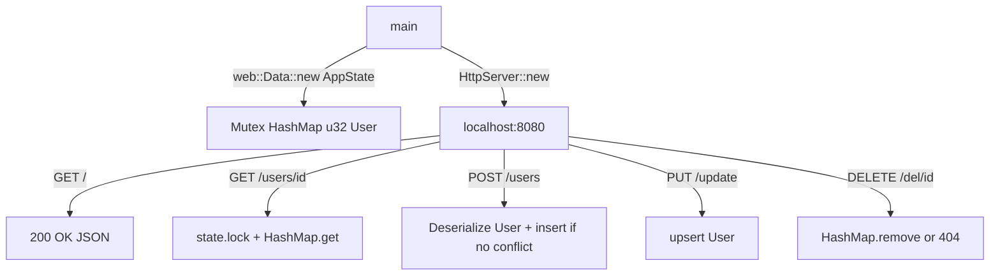

# Developer & Technical Documentation

This document provides a technical guide to the **RestfulApi** application's architecture and execution.

---

## System Architecture

The application is a single-file Actix-Web server using shared mutable state behind a `Mutex`.



---

## Directory Structure & File Roles

```
.
├── src/main.rs         # All route handlers, AppState, and server init
├── build.rs            # Cargo build script
├── Cargo.toml          # Dependencies: actix-web, serde, serde_json
├── README.md           # General overview
└── Documentation.md    # Technical documentation
```

---

## Workflow

The execution flow of RestfulApi:
1. **Initialization**: `main` seeds a `HashMap<u32, User>` with a default user. It wraps it in `Mutex::new` inside `AppState`, then passes it to each worker thread via `web::Data::new`.
2. **Request Handling**: Each handler receives `web::Data<AppState>` and calls `state.users.lock().unwrap()` to safely access the shared map.
3. **CRUD Logic**:
   - **POST `/users`**: Checks `users.contains_key` before inserting — returns `409 Conflict` on ID collision, `201 Created` on success.
   - **PUT `/update`**: Uses `users.insert` unconditionally (upsert). Returns `200 OK` if the key existed, `201 Created` if it was new.
   - **DELETE `/del/{id}`**: Calls `users.remove`. Returns `204 No Content` on success or `404 Not Found` if absent.

---

## Launcher Compilation Guide

### Compilation or Execution Commands

```powershell
# Run the server in development mode
cargo run

# Build the optimized release binary
cargo build --release
./target/release/restful_api
```
